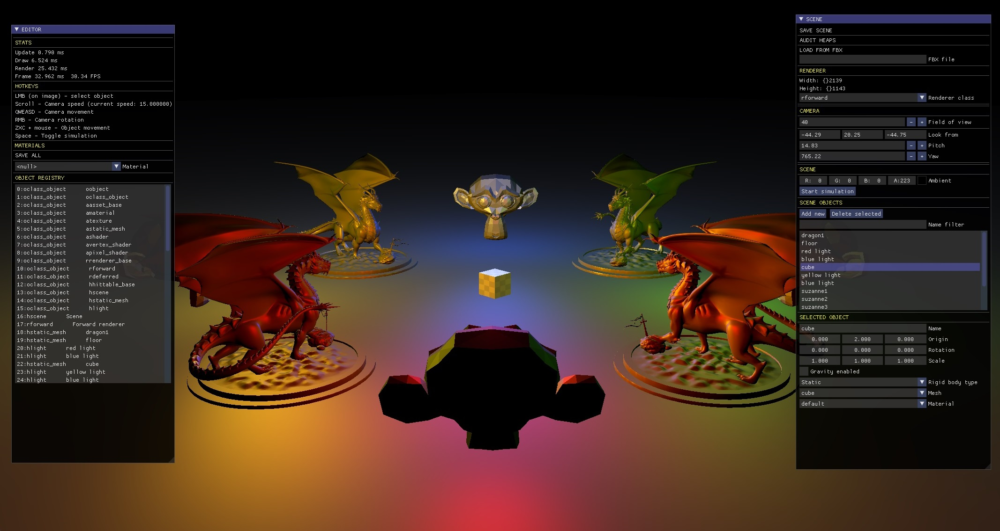
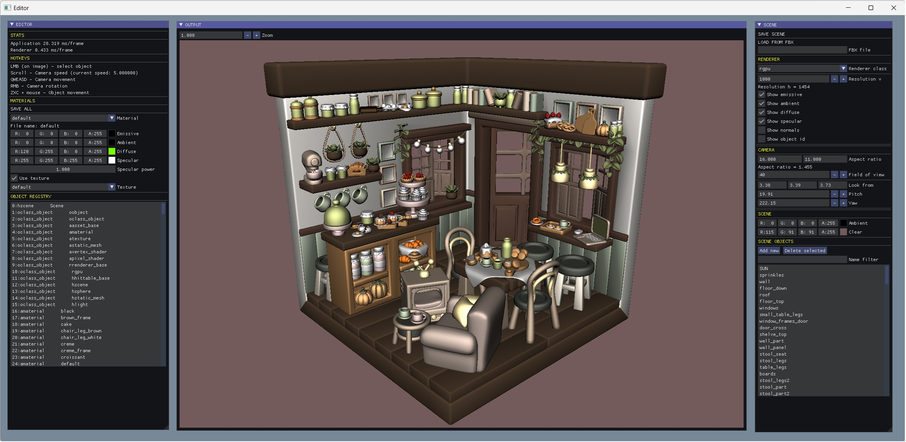

## Planet sandbox
**GPU Rendering sandbox**

Author: planet620

This is a fork of the previous project [2.3] (Ray Tracer release 2.3)
All CPU rendering functionality has been removed.
The goal is to achieve the same result but with DX12 and DXR.

Features added so far:

[3.0] - DX12 with DXR version
 - in progress

[2.0] - DX12 version
- All features included in [1.0] release
- GPU resources and heap management
- Multi-pass architecture
- Bindless textures (dynamic indexing and unbounded arrays)
- Hot-reloadable DXC shader compilation pipeline with shader cache
- Physics system for object selection and rigid body simulation
- Crash handling and dumping for both C++ and structured exceptions
- Aftermath integration for GPU crash handling and crash dumps
 

[1.0] - DX11 version
- Simple scene rendering, forward renderer, deferred renderer
- Phong lighting model
- Engine and editor separated to a DLL and EXE
- Custom RTTI and memory manegament for resources like scene objects, assets, shaders etc.
- Persistent soft asset pointers
- FBX scene import
- Support to multiple project folders (use command line argument fbx_scene_test or cozy_kitchen)
- Improved UI
    - Material editor
    - Managed objects list
    - Scene editor
    - Object selection and highlight
    - Combo list for managed objects
    - Object selection

Example scene: [Cozy Kitchen] imported from Blender.

### Third party dependencies
DirectX 12

[Nsight Aftermath SDK] v2.23 2024.2.0.24200
NVidia R445 or newer is required

[Nsight Aftermath SDK Samples] v2023.2

[DirectX 12 Agility SDK] v1.614

[DirectX Shader Compiler] v1.8.2407

[ocornut/imgui] v1.87

[nlohmann/json] v3.10.5

[PIX for Windows] v1.0.220124001

[STB Image] v2.27

[spdlog] v1.x

[assimp] v5.4.1

[React Physics 3D] v0.10.2

[//]: # (links)

   [1.0]: <https://bitbucket.org/planet620/planetsandbox/src/release_1.0/>
   [2.0]: <https://github.com/mpolaczyk/planet_sandbox/tree/release_2.0/>
   [2.3]: <https://bitbucket.org/planet620/raytracer/src/release_2.3/>
   [ocornut/imgui]: <https://github.com/ocornut/imgui>
   [nlohmann/json]: <https://github.com/nlohmann/json>
   [PIX for Windows]: <https://devblogs.microsoft.com/pix/download>
   [STB Image]: <http://nothings.org/stb>
   [spdlog]: <https://github.com/gabime/spdlog/tree/v1.x>
   [assimp]: <https://github.com/assimp/assimp>
   [Cozy Kitchen]: <https://www.blender.org/download/demo-files>
   [DirectX 12 Agility SDK]: <https://www.nuget.org/packages/Microsoft.Direct3D.D3D12/1.614.0>
   [DirectX Shader Compiler]: <https://github.com/microsoft/DirectXShaderCompiler/releases/tag/v1.8.2407>
   [Nsight Aftermath SDK Samples]: <https://github.com/NVIDIA/nsight-aftermath-samples/releases/tag/2023.2>
   [Nsight Aftermath SDK]: <https://developer.nvidia.com/nsight-aftermath>
   [React Physics 3d]: <https://github.com/DanielChappuis/reactphysics3d/tree/v0.10.2>